# Implementation of Spatial Partitioning using PCA

## Introduction

The PCA Custom Analysis module in IVAS provides a way to partition the voxels into groups representing "similar" compositions.  This document outlines how the algorithm is meant to work for this process, with step by step instructions for users.

The spatial partitioning process can also be called "phase identification".  However, there is nothing rigorously thermodynamic about the resulting phases, although they may likely correspond to different regions of actual thermodynamic phases in a sample.

## Primary Component Analysis (PCA)

Primary Component Analysis is a matrix math technique for reducing large-dimensional data sets into a smaller set of relevant dimensions. One can read about the math involved elsewhere. 

In the case of Atom Probe data, the IVAS PCA module divides the sample volume into voxels, and each voxel gets N dimensions of data associated with it.  In the simplest case, the N dimensions correspond to N elements defined by mass ranges, and so the data fed into PCA is the calculated chemical composition of each voxel.

The PCA process identifies the D dimensions in the data (ideally, D is significantly smaller than N) that best differentiate the voxels from each other.  So, for example, if D is 4, the result of PCA is a four dimensional vector for each voxel -- these are referred to as the "scores" for each voxel in those 4 dimensions.  The dimensions for these vectors will be referred to as "PCA space" -- a D-Dimensional space.

Voxels with similar compositions will have similar D dimensional vectors, and so identifying regions in the sample corresponding to different phases could be as simple as an exercise in cluster identification in D dimensions. However, a number of factors make this difficult.  D could be large, making it difficult to identify clusters.  The number of voxels of interest might be small, making cluster identification difficult.  And, because of phase boundaries between regions of different concentrations, and statistical variations, clusters corresponding to minority phases, such as small precipitates, may not exist at all.

The algorithm implemented in the IVAS PCA module attempts to identify regions corresponding to different phases despite these challenges.  The following is a guide to using this module.

## Instantiation of the PCA Custom Analysis component

Like other Custom Analyses, a component can be instantiated by selecting the menu item in the "Custom Analysis" section of the AnalysisTree contextual menu, as shown here:

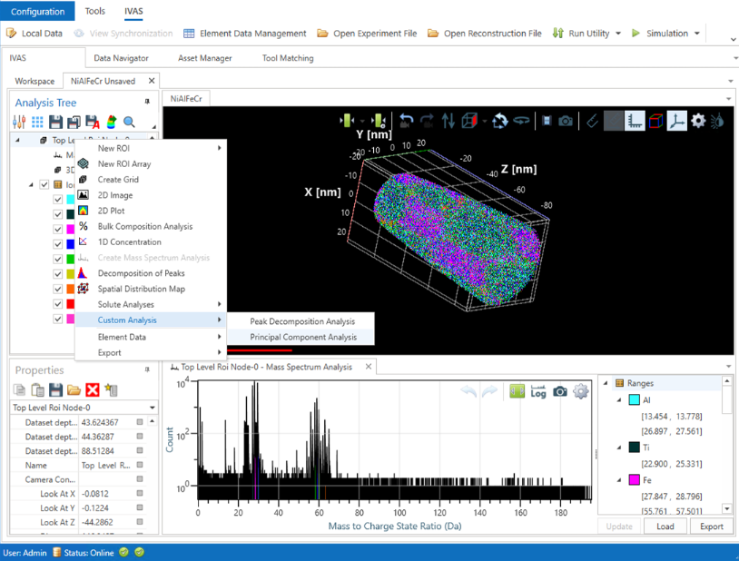

After selecting the "Principal Component Analysis" item, IVAS will display this:

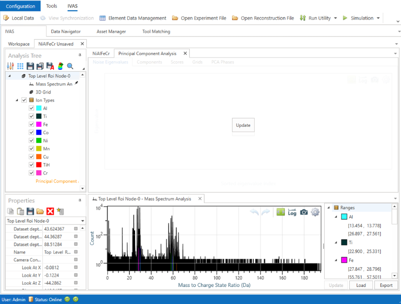

## The Eigenvalues Tab

Clicking the "Update" button will perform an initial evaluation for a PCA algorithm run, and will display a chart of eigenvalues on the y axis for each successive PCA dimension on the x axis:

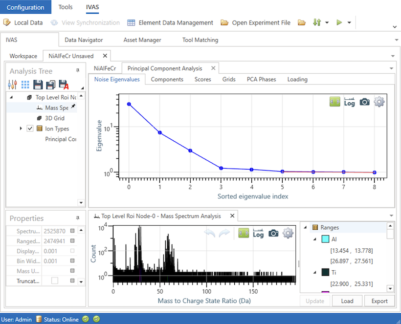

In short, the higher the "eigenvalue", the more confidence we have that the information in that PCA dimension is valuable. 

In the image above, the first three dimensions, at eigenvalue indices 0, 1, and 2 look very trustworthy. The decreasing value of the eigenvalue indicates that each progressive PCA dimension contains less differentiation between the different voxels. 

The remaining dimensions are less trustworthy, but are still likely to have useful signal.  Typical PCA analyses are expected to show a flat line when the next successive dimensions offer no differentiation.  In this example, the eigenvalue indices at 3 and 4 are seen to be slightly above the flatline at indices 5 and above, as shown in the zoomed in image here:

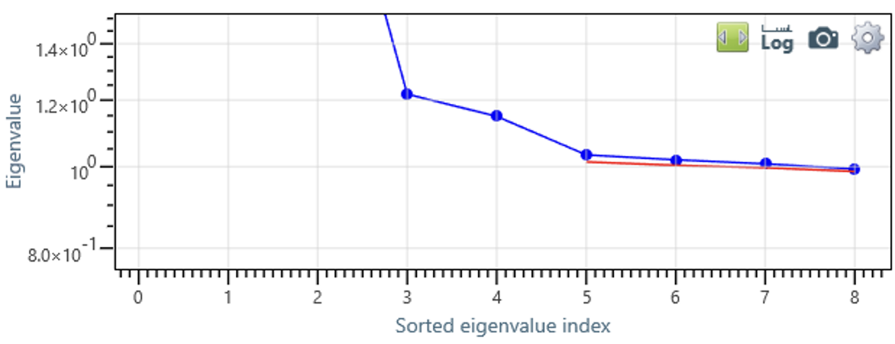

There is work in progress to display a red line to delineate the difference between real PCA signal and PCA noise -- the distance of points above the line indicate how much real signal these PCA dimensions capture. The red line is drawn where a PCA analysis is expected to capture random noise. This red line can be seen in the zoomed in image just below the data points of indices 5 through 8.

At this point, the user can manually choose the number of PCA dimensions of interest.  For the purposes of this tutorial, we'll choose 4.  The choice is made by editing the "Dimensions" item in the "Components" panel underneath the analysis tree:

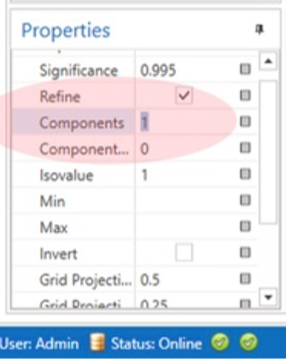

## The Components Tab

After selecting the number of components, user should click on the "Components tab, revealing another "Update" button:

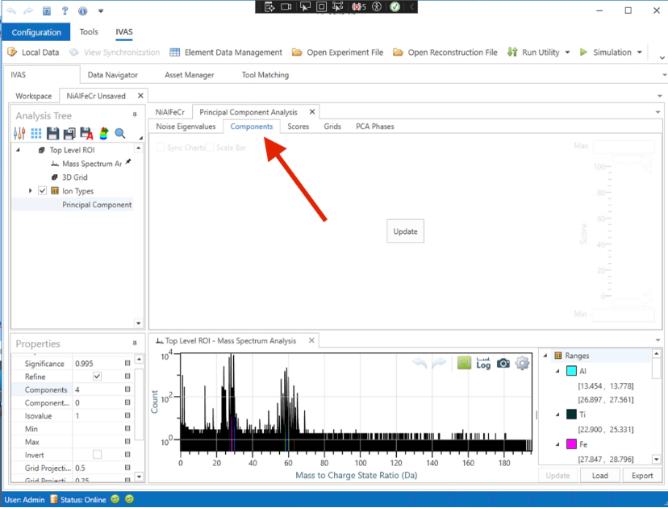

Clicking "Update" here will actually invoke the matrix math at the heart of PCA analysis:

The resulting screen will show a grid of atom views, one for each PCA dimension chosen.  We chose 4 "Components", so there are four dimensions of PCA data generated -- the four voxel maps display the "scores" for each voxel along the given dimension.

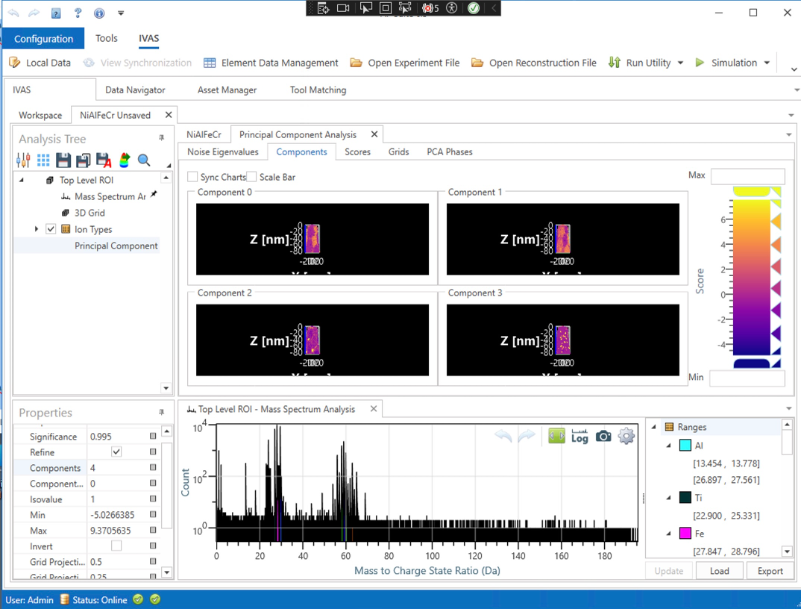

It is recommended here to click the "Sync Charts" button and rotate the atom maps to inspect the results:

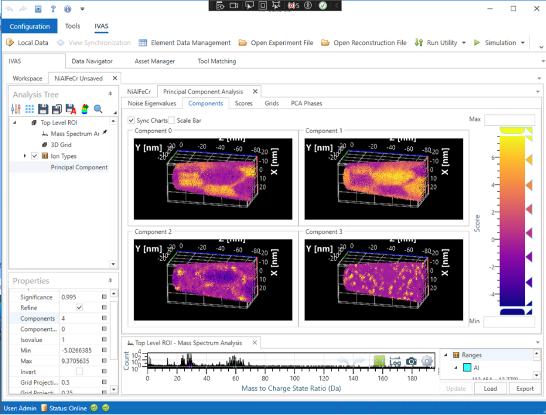

## The Scores Tab
 
Clicking in the next tab, "Scores" shows a one dimensional distribution of the voxels along one of the PCA dimensions:

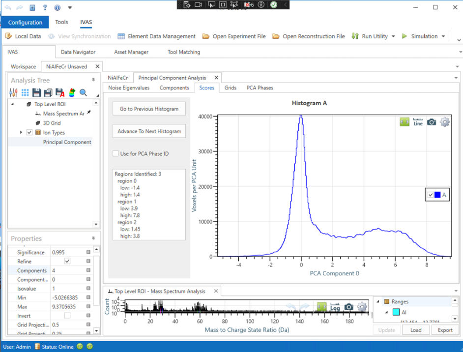

In this view, a histogram is shown with the number of voxels with the given score in the PCA dimension.  This histogram is labelled "Histogram A", as it is the first PCA dimension -- the second dimension is labelled "Histogram B", etc.

One can cycle through the different dimensions using the "Go to Previous Histogram" and "Advance to Next Histogram" buttons.

An information pane shows some data about the result of peak identification as applied to this histogram.

Importantly for the partitioning algorithm, there is a "Use for PCA phase ID" check box.  To use the data in this 1 dimensional projection as part of the region identification algorithm, user can check the box.  In this example, however, we will leave the box unchecked, as this dimension will be included as part of a 2D projection -- see below.

## The Grids Tab

Clicking next of the "Grids" tab reveals 2Dimensional projections of the same data:

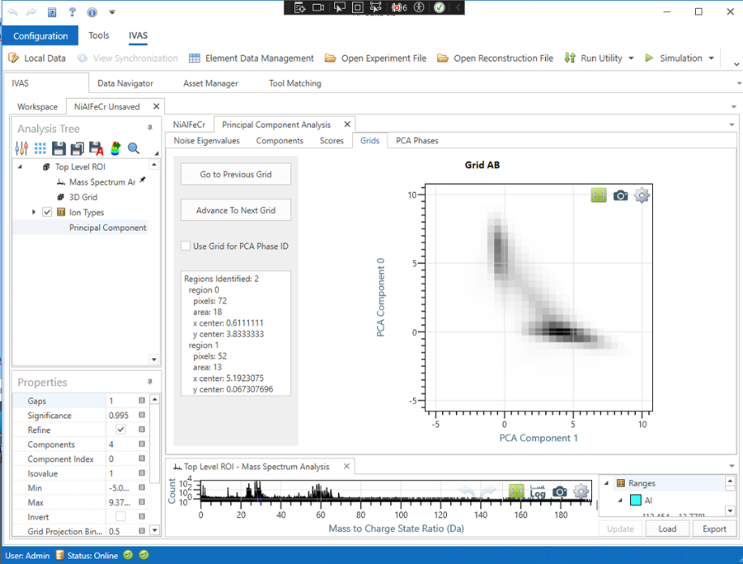

In this screenshot, the PCA data from the first and second dimensions are plotted against each other -- it is labelled "Grid AB" to denote the information from Histograms A and B are used.

Again, information is displayed about the results of a 2D peak identification algorithm.  

The "Go to Previous Grid" and "Advance to Next Grid" buttons can be used to view the different projections.  

As the AB grid seems to nicely distinguish the voxels into two separate groups, we'll click the checkbox for "Use Grid for PCA Phase ID":

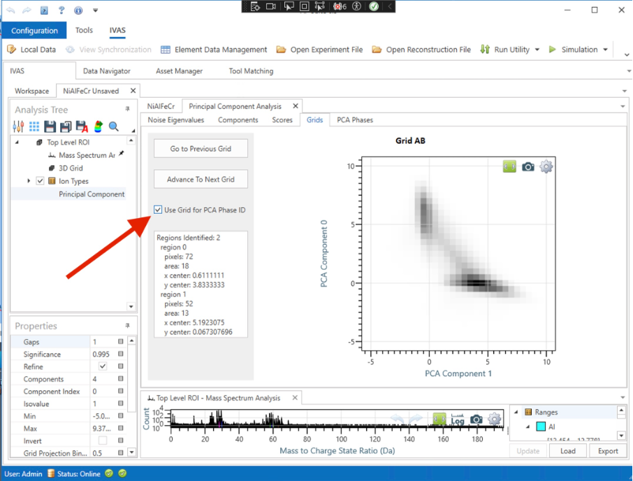

## The PCA Phases Tab

If at this stage we advance to the next tab, "PCA phases" , we are presented with another "Update" button.  Clicking the button initiates the PCA phase identification algorithm, based on which of the grids and histograms have had a checkbox checked for inclusion of the data in the phase ID algorithm.  In this case, we have only one grid selected, so the algorithm assigns voxels bases on two core regions -- the two peaks identified in Grid AB:

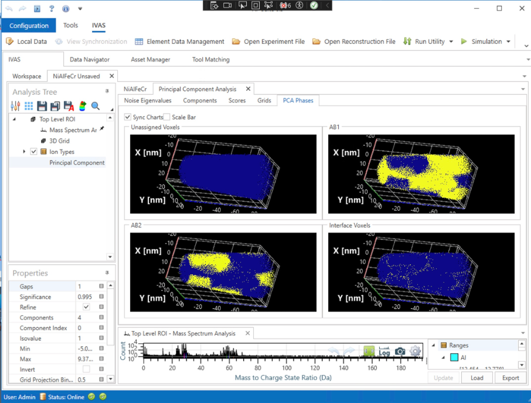
 
For a deeper dive into the algorithm, see the companion document [SpatialPartitioningAlgorithm.md](SpatialPartitioningAlgorithm.md). The algorithm goes as follows: 

First, voxels that are unambiguously in each of the peaks identified in Grid AB are assigned as part of the core regions.  

Second, voxels that are not unambiguously in either peak become candidates for adding to one of those two core regions.  All voxels which neighbor the core regions are evaluated for addition to the regions.  However, voxels that are adjacent to both core regions become "interface voxels".

In the case of just two core regions, the logic is straightforward.  The interesting implementation details for this case are a) the order in which candidate voxels are considered for inclusion into a core region, and b) the criteria for an "interface voxel".  That is, a voxel which shares 3 edges with one core region, while sharing a single corner point with another core region could be consider to be an interface voxel, or could be considered as part of the first core region.   The exact details for this process is a work in progress.

Now we will consider a more difficult case, where we add another PCA dimension's information to the Phase ID algorithm.  Let's go back to the "Scores" pane and advance to histogram D, and check its "Use for PCA Phase ID" box.

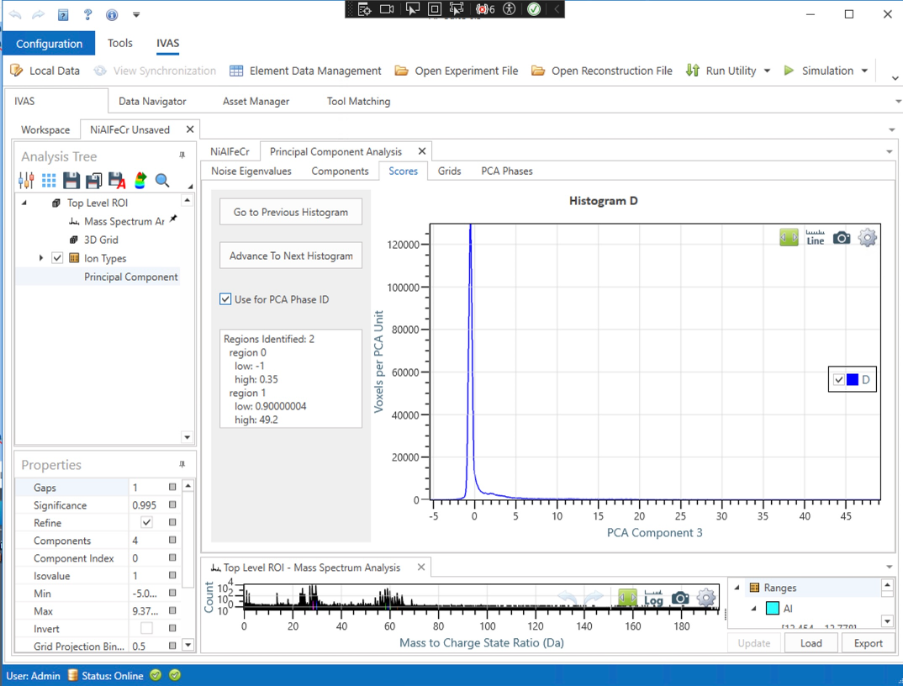
 
The peak identification routine has divided histogram D into two parts, and as such some voxels will get a D1 designation and other will get a D2 designation.  Voxels not in either region will get a D? designation.

Now voxels in the sample hve both an AB designation and a D designation,  so the core regions identified will be AB1D1 , AB2D1,  AB1D2, and AB2D2.

Returning to the PCA Phases tab, the Update button will again be enabled, because the set of data to be supplied to the algorithm changed when we checked the box in histogram D.  Clicking the "Update" button results in this:

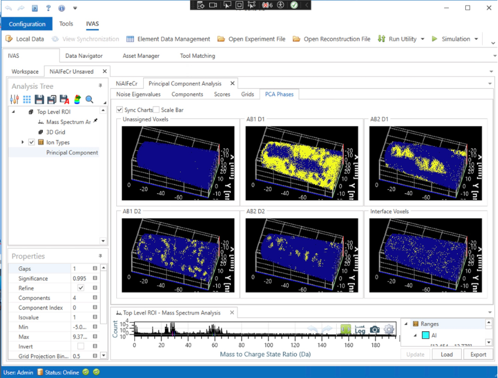

Now there are regions identified for each of the four core designations.

## Exporting a Region of Interest

The PCA extension offers two modes for generating a "Detached ROI", allowing other IVAS components to operate on a region of interest. The first mode generates an ROI based solely on the 'score' for each voxel in a particular PCA dimension. The second mode generates an ROI based on the phase assigned by the Phase ID identification algorithm.  The second mode is used if the "Use PCA Phase for Detached ROI" checkbox in the properties panel is checked:

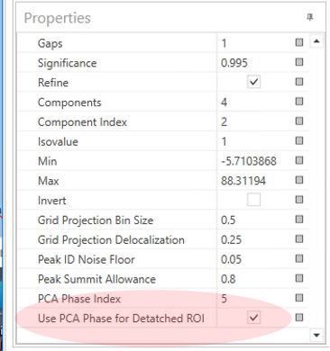

When generating a ROI based on the PCA Phase identification, which phase to export is selected by specifying an index in the "PCA Phase Index" row.  This should be an integer, and is zero indexed.  That is, specifying 0 here corresponds to the "Unassigned Voxels" phase (displayed in the upper left in the grid view.  Increasing numbers proceed left to right and top to bottom in the grid view.  In the current example, specifying 1 will correspond to the "AB1D1" phase, displayed to the right of "Unassigned Voxels".  2 means AB2D1, 3 means AB1D2, 4 means AB2D2, and 5 means "Interface Voxels".

Some parameters are exposed to the user for tweaking how the PCA phase identification algorithm works.

## Grid Generation Parameters

The parameters "Grid Projection Bin Size" and "Grid Projection Delocalization" control how the 2D grids are produced. The bin size specifies, in units of PCA score, how big the buckets are in the projection.  The bucket size is visible in the grid projection -- in this case, the grid size is 0.5, and 10 grid squares are visible in the space between 0 and 5:

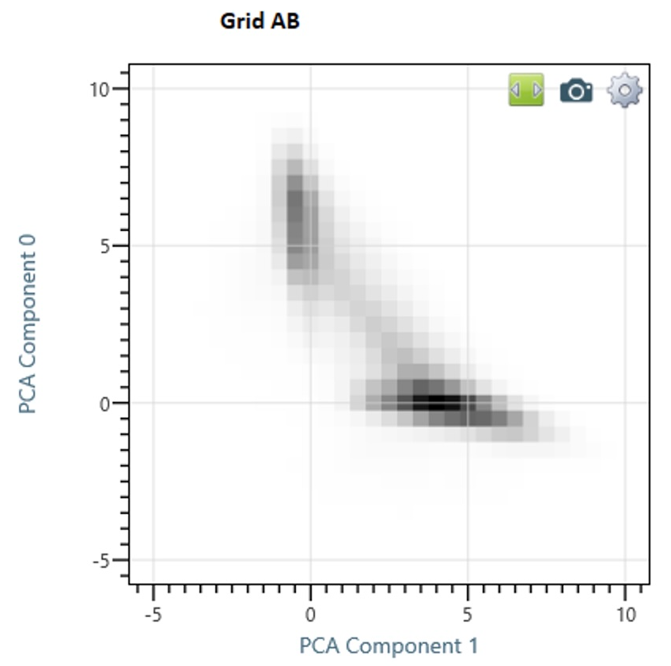

Note that the buckets are centered on the {0,0} origin.  That is, the 0 coordinate on both axes does not separate buckets, instead the bucket at the origin extends from -0.25 to 0.25 on both axes.

When creating a grid with bucket size N, there is a de facto delocalization of N/2.  The algorithm here uses the "gaussian-ish splat" technique first explained in "Efficient sampling for three-dimensional atom probe microscopy data" (Ultramicroscopy 95 (2003) 199–205).  In this strategy, a data point in a one-D histogram that falls exactly at the boundary of two buckets contributes equally to each bucket, while a data point falling exactly in the middle of a bucket contributes 0.75 to that bucket and 0.125 to each of the neighboring buckets.  This done so that the delocalization for each data point is equal, and this the resulting grid is (mostly) unaffected by the choice of the origin coordinates for the grid.

The parameter "Grid Projection Bin Size" specifies the grid size used in generating the grid.  

Separately, a delocalization can be specified.  A delocalization of less than one half the grid size is not possible, as the generation of the grid creates a de facto delocalization.  However, an additional delocalization can be applied.  So, for example, If a smaller grid size is chosen, but the delocalization stays the same, the generated grid should look the same, but with a finer pixel size.  If a lower delocalization is chosen, the generated grid with smaller bin size may be more noisy, because of the poorer statistics contributing to each grid point.

## Peak Identification Parameters

Two parameters are exposed that adjust how peaks are identified, "Peak ID Noise Floor" and "Peak Summit Allowance".   These two parameters are exposed mostly because the default values chosen for these seem to be rather arbitrary.  The developer sees no reason why the defaults are poor choices, but also can imagine the users will have a variety of samples that might demand different choices.

"Peak ID Noise Floor" is a parameter expressed as a fraction of the tallest peak in the grid.  Any voxels with a population below the tallest peak multiplied by the noise floor are treated as not in any peak.  Users may want to choose lower values to detect very small peaks, though this coiuld increase the number of noise pixels included in larger peaks.

"Peak Summit Allowance" is a parameter that controls if adjacent "twin peaks" are considered to be a single peak.  The default is 0.8.  This means that if two peaks are identified, but the vally between them is higher that 0.8 times the value of the higher of the two peaks, the algorithm will consider the two to be a single peak.

