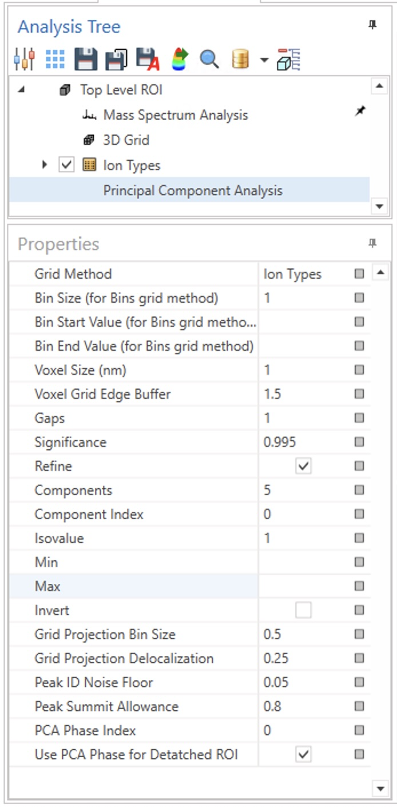

# The PCA Properties Pane

## Overview

There are a number of user-settable parameters used in the PCA calculation.  These parameters usually appear in the lower left side of the IVAS window, when the Principal Component Analysis node is selected, as shown here  
 

These parameters is explained here 

## Parameter: Grid Method

<needs documentation>

## Parameter: Bin Size

<needs documentation>

## Parameter: Bin Start Value

<needs documentation>

## Parameter: Bin End Value

<needs documentation>

## Parameter: Voxel Size

<needs documentation>

## Parameter: Voxel Grid Edge Buffer

<needs documentation>

## Parameter: Gaps

This parameter is used in estimating the rank implied by the eigenvalues -- this is the step which estimates how many useful dimensions of PCA data are available from a PCA analysis. 

Automatic rank-estimation is based on either the largest noise eigenvalue, if gaps is zero, or the gap between the largest and nth largest noise eigenvalues if gaps is greater than zero.

In this case, "rank" is used to nake a first estimate of the number of PCA components to be calculated in the next step of the analysis.

## Parameter: Significance

This parameter is the Bornemann Table Significance used in estimating the rank of implied by the eigenvalues.  

## Parameter: Refine

This is another parameter used in estimating the rank of implied by the eigenvalues.  If checked, the eigenvalues initially calculated are recalculated using the first iteration's estimated rank as a parameter, and a new estimate of rank is performed based on the new eigenvalues. If the new rank estimate changes, the recalculation is done up to two more times.

## Parameter: Components

This parameter controls how many dimensions of PCA scores will be produced.

If it is reset, many of the Panes will display an "Update" button, as the PCA scores of all the voxels for all the dimensions will be cleared.

## Parameter: Component Index

This parameter controls the PCA dimension used to export a region of interest based on PCA score. In this scneario, the region of interest is all the voxels with a PCA score on this dimension greater than some threshold. To export such a region of interest, the "Use PCA Phase for Detatched ROI" parameter must be false

## Parameter: Isovalue

This parameter controls the threshold used to export a region of interest based on PCA score. In this scneario, the region of interest is all the voxels with a PCA score on the specified dimension greater than this threshold. To export such a region of interest, the "Use PCA Phase for Detatched ROI" parameter must be false

## Parameter: Min

<needs documentation>

## Parameter: Max

<needs documentation>

## Parameter: Grid Projection Bin Size

This is the bin size used when making a 2D grid as part of the Phase Identification Algorithm.  The effect of adjusting this parameter can be seen in the grids displayed on the Grids Tab.  For example, if this value is 0.1, the size of each 'pixel' in the grid will be a square of 0.1 x 0.1 on each PCA axis.

The bins exist on the PCA axes, so the units of this parameter are in the units of the PCA scores.

## Parameter: Grid Projection Delocalization

This is the delocalization used when making a 2D grid as part of the Phase Identification Algorithm.  The delocalization inherent in the Grid generation is one half the bin size.  If this value is greater than one half the bin size, an additional delocalization will be applied, thus smoothing out statistical noise due to lower populations in the bins as they get smaller.

If a user is tempted to decrease the bin size to get more precise partitioning of peaks in the grid, it is suggested to keep this value constant, as this will ensure that statistical noise will not cause different peaks to be identified.

The units of this parameter are also in the units of the PCA scores.

## Parameter: Peak ID Noise Floor

This parameter governs where the algorithm "gives up" when looking for pixels to add to identified peaks, or for identifying new peaks. This is expressed in a fraction of the value in the most populated grid point.

As an example, if this value is 0.05, then for any grid point to be included in a peak, it must have a population of at least 0.05 times the population of the grid point with the maximum population.

## Parameter: Border Exclusion Ratio

This parameter controls the width of the boder zone between overlapping peaks identified in 1D or 2D PCA space.

Pixels (2D) or Bins (1D) close to a border with another peak will not be associated with the peak -- this parameter is sets the threshold for drawing this line.  Specifically, it is the ratio between the distance of a candidate pixel or bin to the border vs. its distance to the peak maximum.

As an example, if the distance of a bin to its border is B pixels, and its distance to the peak maximum is M pixels, that bin is included in the peak if the border exclusion ratio is less than B/M

The default value of this parameter is 0.2

## Parameter: Peak Summit Allowance

This parameter controls the allowance given for treating two nearby maxima from being treated as separate peaks.  Statistical noise or some other condition might cause what appears to be a single peak to have two local maxima. This parameter is expressed as a fraction of the value in the more populated maximum grid point. As an example, if this parameter is 0.8, then if the value at the saddle point between the local maxima is greater than 0.8 times the value at the greater local maximum, then both maxima are considered to be part of the same peak.  That is, there are two different summits of the same peak.

## Parameter: PCA Phase Index

This parameter controls which phase or PCA dimension is used when exporting a detached region of interest corresponding to a PCA phase.  So the exact interpretation depends on the value of the next parameter.

If the "Use PCA Phase for Detatched ROI" checkbox is checked, then this is the index of the PCA phase used.

If the "Use PCA Phase for Detatched ROI" checkbox is unchecked, then this parameter is unused

## Parameter: Use PCA Phase for Detatched ROI

This checkbox controls whether or not a detached region of interest represents a PCA Phase or a PCA dimension.  If checked, then the detached region of interest represents voxels in the phase corresponding to that index.  Index 0 is always "unallocated" voxels.  Indices 1 through N correspond to the different phases, in the same order in which they are displayed in the PCA Phases grid. Index N+1 represents the "Interface Voxels" region.

If unchecked, the detached region of interest represents all the voxels assigned a score above a threshold in the PCA dimension specified by the "Component Index" parameter above.  PCA dimensions are indexed from 0, so if there are 5 dimensions, indices 0 through 4 are valid.  The threshold used is specified in the "Isovalue" parameter above.
