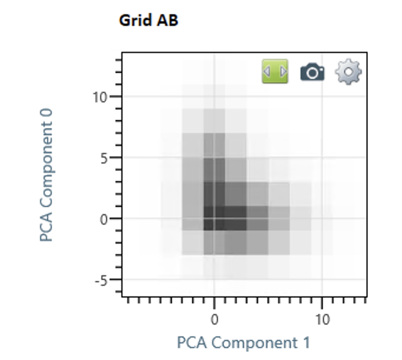
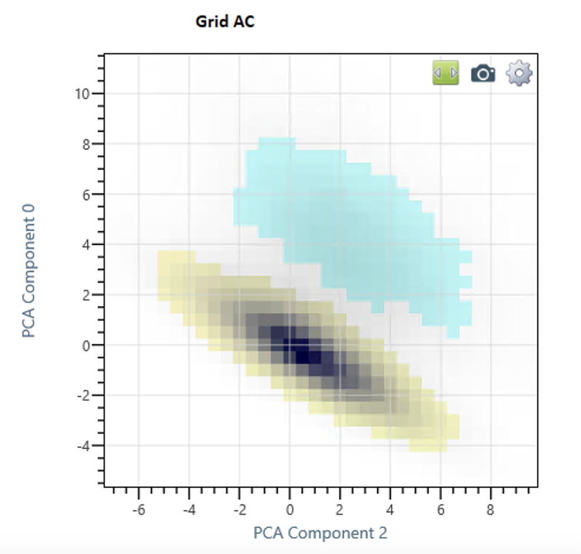

# Implementation of Spatial Partitioning using PCA

## Goal

The goal of the partitioning algorithm is to be able to map each 3D position in a sample to one of a limited set of kinds of regions.  For example, in a sample with two distinct phases, each 3D position might belong to one of the two phases.

There could be any number of ways to perform this partitioning.  The algorithm implemented here is chosen because it can be applied fairly generally, i.e. to many kinds of samples.  

Nevertheless, there are a few user-settable parameters that can tweak the process and thus produce different results.

## Overview

Mapping the results of PCA Analysis to a spatial partitioning should be straightforward.  The sample can be divided into a 3D grid of voxels -- each voxel has an array of values corresponding to some metric.  The PCA math is used to generate a score for each voxel for each of N PCA dimensions.  These scores are then plotted in N dimensional space.  Each partition should correspond to a cluster of values in this N dimensional space. A clustering algorithm can identify which voxels belong to each cluster, and partitions are defined based on the cluster-to-voxel mapping.

There are issues with this approach which made is difficult to implement.  Foremost, it does not scale well for large values of N.  For example, In the case of 5 PCA dimensions, even if the space is divided into only 10 bins per dimension -- which is too few bins to actually distinguish clusters -- there are already 100,000 cells with which to identify clusters. 

As an example, here is a 2D projection of PCA data in a 10 by 10 grid (data actually extends higher and lower, but is put in "overflow bins" for memory conservation).  At higher resolutions, two clusters are distinguishable:

Expanding to 32 bins per dimension, where there is hope of identifying both clusters and clean boundaries between them, means more than 33 million cells, which is memory taxing for our systems.  Additionally, at this point, the statistics of cell population mean that statistical error will be significant in the cluster identification process.

There are ways with which these problems could be tackled, and users wishing to explore N dimensional clustering are encouraged to do so. But we have not chosen to pursue this strategy here.

Instead, The approach here looks at ways to identify clusters using only one or two PCA dimensions at a time. Sometimes, using a single PCA dimensions score is enough to differentiate voxels from different phases.  More often, plotting the PCA scores on two dimensions results in a clearer partitioning.

If the goal is merely to identify two different phases, then a single partitioning is sufficient.  Identifying more than 2 phases with this strategy, however, requires combining the partitions identified in different combinations of PCA data.  That is, the partitions identified in a 2D Plot of PCA dimension 1 and PCA dimension 2 might be overlaid with partitions identified in a 1D plot of PCA dimension 3, resulting in a partitioning matrix.  This matrix is used as the basis for a complete partitioning algorithm.

## Algorithm Outline

1. Generate 1D and 2D plots of the PCA data which show how the voxels might be partitioned
2. Select which partitionings (i.e. which 1D or 2D plots) should be included in the rest of the algorithm
3. For each partitioning, separate voxels into "Group 1", "Group 2", etc., and a "Group ?".  "Group ?" corresponds to those voxels not obviously in any cluster, either because they are in between, or because they are sufficiently far away from the cluster center, or because there are insufficiently many similar voxels with similar PCA scores.  
4. Nomenclature: Each partition is designated with a Letter label. The first partitioning is "A"", the second "B", etc.  Each group within the partitioning has a number, "1", "2", etc., or "?"
5. Using the nomenclature in part 4, designate each voxel with a label for each partitioning.  Example, with three partitions, a voxel which is is in group 1 of all three partitions would be "A1B1C1".  A voxel in group 2 of the first partition and not in any group of the other two would be "A2B?C?"
6. Designate as "core regions" all the voxels that do not have a "?" in their designation. These are the sets of voxels which define the basis for regions that will grow in the successive steps.
7. Identify all voxels that are not in a core region, but are, in real 3D space, adjacent to a voxel in at least one "core region". The particulars of how to determine "Adjacent" are discussed below
8. Evaluate each of the voxels identified in step 7.  If the designation applied in step 5 is similar to the designation of the core region it is adjacent to, add the voxel to that core region.  If the voxel is equally similar to two different adjacent core regions, add it to an "interface voxel" partition -- it will not be added to any core region. The particulars of how to determine "similarity" of voxels are discussed below
9. If any of the voxels in step 8 have actually been added to a core region, repeat steps 7 and 8 indefinitely.
10. Any remaining voxel which has no assignment different enough from all its adjacent voxels as to fail the test in step 8.  These voxels constitute the "unassigned voxel" partition
11. At this point, all the voxels will either be 
* part of a core region, 
* part of the "interface voxel" partition
* part of the "unassigned voxels" partition 
  
The number of spatial partitions identified will be the number of core regions, plus one (likely) for interfacial voxels, plus one (maybe) for unassigned voxels.

## Identifying Partitions in One Dimensional Data

There are two modes to how a one dimensional profile could be used to define partitions. 

### First 1D Mode

In the first mode, there are two or more identifiable peaks in the one dimensional profile -- each peak can correspond to a partition.

### Second 1D Mode

In the second mode, there is only one identifiable peak.  The voxels that are obviously part of the peak are the first partition.  The voxels that are an appreciable distance away from the peak are a second partition.  Voxels close to, but not in the peak are part of neither partition.

### Creation of the 1D Profile  

The data for a one dimensional profile is just that - one dimension of values, each representing a constant-width region of the PCA dimension.  The values in each bin are the population of voxels near the bin. 

That is, the data is not strictly a histogram -- it is not a count of voxels with a PCA score within the range of that bin.  Instead, it is sampled, such that each voxel contributes to multiple bins.

In the case of minimum smoothing, if a voxel has a PCA score exactly between the axis values, then it contributes exactly one half to each value. This split is essentially equivalent to a delocalization of one-half the bin width. If the voxel falls exactly on an axis value, it contributes 3/4 to that bin, and 1/8 to each of the adjacent bins. This also represents a delocalization of of one-half the bin width, where delocalization is the square root of the sum over (P * dX^2).

In the first case, thats

    sqrt (  (1/2) * (1/2)^2  +  (1/2) * (1/2)^2  )
    
                lower bin           higher bin

In the second case, that's 

    sqrt (   (1/8) * (1)^2   +   (3/4) * (0)^2   +  (1/8) * (1)^2   )
    
                lower bin           middle bin         higher bin

Most values are in between these two extremes.  In these cases, the contributions are split between the three closest bins so as to maintain a delocalization of one half the bin separation, and maintain a center weight of the contributions at the value of the voxel.

This data can also have additional smoothing applied. While the minimum delocalization implied when generating a profile is one half the bin separation, an additional delocalization can be applied in a subsequent step. The amount of delocalization is controlled by the user-settable parameter  "GridProjectionDelocalization"

In the code, this parameter is the "oneDProjectionDelocalization", and is set from the Property "GridProjectionDelocalization", because, currently, the same delocation is used for both 1D and 2D projections.

If the delocalization amount is in fact larger than the default delocalization of one half the binsize, then an addition Gaussian Convolution is applied to the array, so that the resulting profile is approximately equal to what would result from applying a Gaussian delocalization to each voxel point individually.

### Partition Finding in a 1D Profile -- First Mode 

Once the 1D profile is made, the first step is to identify its most prominent peak. The applicable part of the code is the class "OneDGridPartitionFinder". The bin with the highest population is identified as the basis of a "peak region", and then neighboring bins are added to the peak region as long as 

- The value in the neighboring bin is a decrease from its neighbor in the peak region
- The value in the neighboring bin is above a "noise floor"

The "noise floor" value is currently hard coded at 5% of the population of the most-populated bin.  Making this a user-settable parameter is a possibility for future work.

If an increase is detected in a next bin, the bin neighboring the bin with the increase is not considered part of the peak, and a new search for a new peak region, as there must be a bin with a higher population that the currently known boundaries of the first peak region. 

If a second peak is in fact identified, then the "First 1D mode" is used for partitioning -- i.e. each peak corresponds to a partition.

The boundary between the peaks, where voxels would not be added to either partition, is currently one bin wide.  This is not ideal, because if there are indeak peaks, the overlapping region between them likely spans more than one bin. Implementing an expanded border region (as is done for the 2D case) is worth additional effort, and is a possibility for future work. 

There is an additional wrinkle which could be worth some extra attention in the future.  It is possible that the data should be treated as a single peak, but because of statistical fluctuations, the top appears to be two peaks, separated by a narrow and shallow valley.  In which case, there could be logic to not differentiate between the two peaks.  This logic is implemented for the 2D case below, but not for the 1D case. 

### Partition Finding in a 1D Profile -- Second Mode 

If only one peak is identified in the profile, it is still possible to designate voxels that are well away from the peak as being part of a second partition. In this Second mode, a second partition is made from all the voxels which have a PCA score higher than 0.5 plus the PCA score of the bin above but not included in the peak.  So, for example, if the binsize is 0.1, and a single peak is identified over the range -1.0 to 2.0 (30 bins), the bin just above and outside the peak is the bin centered at 2.05.  Any voxel with a score above 2.55 will be consided part of a second partition.

The value of 0.5 is currently hard-coded. Making this a user-settable parameter is a possibility for future work.

## Identifying Partitions in Two Dimensional Data

### First 1D Mode

Like in the case of partition finding in one dimensional data, there are two modes for two dimensional data. In the first mode, there are two or more identifiable peaks in the two dimensional profile -- each peak can correspond to a partition.

### Second 1D Mode

In the second mode, there is only one identifiable peak.  The voxels that are obviously part of the peak in the 2D grid are the first partition.  The voxels that are an appreciable distance away from the peak are a second partition.  Voxels close to, but not in the peak are part of neither partition.

### Creation of the 2D Grid

The basis for finding cluster in 2D is a 2D grid of bins that represent the population of voxels with PCA scores in two PCA dimensions near that grid point. As in the 1D case, it is not just a histogram -- it is a sampling of each voxel's PCA scores projected onto those two dimensions.  Each voxel can contribute to nine different bins -- the contributions are weighted to cause a constant delocalization for each voxel, and maintain the weight of its contribution centered at its score.  

The contributions for each dimension are calculated separately for each dimension (using the same process as for the 1D contribution) and then multiplied together.  So, for example, if the voxel has PCA scores which place it exactly in the center of one bin, each dimension will be split on each axis by 1/8, 3/4, 1/8, resulting in the contribution grid:

     __________________________ 
    |        |        |        | 
    |        |        |        | 
    |  1/64  |  3/32  |  1/64  |   
    |        |        |        |   
    |--------------------------|
    |        |        |        |      
    |  3/32  |  9/16  |  3/32  |   
    |        |        |        |  
    |--------------------------|
    |        |        |        | 
    |  1/64  |  3/32  |  1/64  |  
    |        |        |        |    
    |__________________________|
    

For a given binsize, the implied delocalization distance in each of the two dimensions in the grid is one half the binsize. Because the grid is two dimensional, the total delocalization when generating the grid is the binsize divided by square root of two.

Additional smoothing is also possible, and this is again controlled by the user-settable parameter "GridProjectionDelocalization" in the properties pane.  Note, that this parameter is "per dimension".  The actual 2D delocalization of the generated grid is this value times the square root of 2.

The procedure is analagous to the 1D case, but applied symmetrically in both PCA dimensions.  The applicable code is in the file PcaScoresGrid.cs, in the function CalculateTwoDDensity()

### Partition Finding in a 2D Profile -- First Mode 

Once the 2D profile is made, the process is very similar to that of the 1D case. First, the grid point with the global maximum is found, and this is the basis for a first partition. Neighboring grid points are added to the peak in order of decreasing grid point population, provided that

the first step is to identify its most prominent peak. The applicable part of the code is the class "OneDGridPartitionFinder". The bin with the highest population is identified as the basis of a "peak region", and then neighboring bins are added to the peak region as long as 

- The value at the neighboring grid point is a decrease from its neighbor in the peak region OR the value is above a "twin peaks" threshold
- The value at the neighboring grid point is above a "noise floor"

The "twin peaks" threshold is an exception to the rule that looks for a new peak if there is a neighboring bin with a higher value than its neighbor in the peak region. This logic is to allow for the case where a single peak has two local maxima because of statistical variations.  In the UI. this parameter is the "Peak Summit Allowance".  that is, if the valley between two peaks is greater than the the Peak Summit Allowance times the peak maximum, the algorithm considers them a single peak.  The default value for the Peak Summit Allowance is 0.8

The noise floor is also a user-settable parameter.  Grid Points with a value lower than the noise floor times the value of the maximum of the highest peak will not be assigned to any partition.

If a neighboring grid point is found to have a higher value than its neighbor in the peak region, this means there must be another peak maximum to be found.  The grid point with the maximum value not yet included in a peak is located and a new peak region defined. Then, the process to add neighboring grid points to one of the peaks continues. If a grid point is considered and is neighbor to more than one peak, it is added to a special "peak border" group, which will be used later to remove grid points from peaks.

The algorithm of assigning grid points to peaks continues until there are no grid points remaining above the noise floor.

At this point, some of the grid points are removed from their assigned peak, because they are in the overlap region between two or more peaks. The criterion used is this:

There is a parameter called the "border exclusion ratio" -- lets call it BER here. Each grid point in every peak is considered, and its distance to its peak maximum (DPM) is calculated. if it is closer to any grid point in the "peak border" group than BER * DPM, then it is removed from the peak.  This creates a border zone around boundaries between peaks, as can be seen in the following screenshot:

The Border Exclusion Ratio is not user-settable, but hard coded to 0.2.  Exposing this as a user-settable parameter could be a project for future work.

Visually, this border area is seen in this image :

The logic for this implementation is in the class TwoDPartitionFinder in the function FindPartitions()

## Identifying "Adjacent" Voxels for Consideration when Growing the Core Regions

There could be any number of ways to generate a candidates list for growing the core regions.  The currently implemented strategy is the simplest:  All voxels that share a face with a voxel in a core region is considered. There is no extra consideration for voxels which share an edge or a corner.

The main hypothetical drawback to this approach is that regions might grow faster in the x y and z directions than in other directions, and lead to aniosotropy. 

Another less likely bad scenario is if there are many unassignable voxels -- only considering voxels that share an face might be too restrictive a condition to allow every voxel in the sample to be considered. 

## Evaluating Voxel Similarity when Growing the Core Regions

There could be any number of ways to evaluate the similarity of voxels for the core region growth evaluation in step 8.  The algorithm here can likely be improved by making this evaluation more complex.  

The current implementation is extremely simple.  Voxels are considered similar to the core region if a single designation differs from that of the core region.  Because the core regions never contain a ? designation, this means that the only unassigned voxels that qualify are those that have a single ? in place of one of the core regions designations.  Example:  if the core region is A1B1C1, a neighboring voxel would qualify as "similar" if it has one of the designations A?B1C1, A1B?C1, or A1B1C?

This also means that voxels with designations that include more than one ? will always end up as unassigned voxels.

While the advantage to this approach is its simplicity, it is likely to break down significantly as more grids/dimensions are selected for inclusion in the algorithm.  Work to improve this piece is the likeliest source of improvement in the future.

## Why Use Concentrations as Input for PCA

One appeal of PCA analysis is that is is agnostic to the meaning of the input data. This implementation uses the concentrations of identified elements in each voxel as input for the calculation, but there is no reason why other data could not be fed in as well. Raw peak counts, for example, could be used, requiring no mapping of peak to ion.  The total population of ions in each voxel could be used, or the number of each identified ion.

PCA is fundamentally a "dimension reduction technique" -- i.e. if P dimensions of data per voxel are fed into the calculation, PCA will produce P - Q dimensions of data that are most relevant to differentiating the voxels. There is fundamentally no penalty for using additional data.

However, PCA analysis is also agnostic to the meaning of the data it produces, and it is likely that it will generate scores based on trends in the data that are unwanted for the purposes of phase identification.  

For example, we know that because the voltage increases during an APT run, the mix of single and double charged ions will also change over the during the run.  If we were to use raw peak counts, part of the scores generated by PCA would be differentiating voxels based on when during the run the data for that voxel was collected.  And, most problematically, it might be hard to tell how that data is captured in the PCA results.

Similarly, using any measure directly associated with the density of the sample would produce part of the PCA results that reflected voxels near the sample surface, where the "density" is affected because part of the voxel is expected to be vacuum.

Using only concentration of the voxels is a good way to shield the PCA analysis from identifying trends in the data that we already know about and we already know do not contribute to the goal of phase identification.

